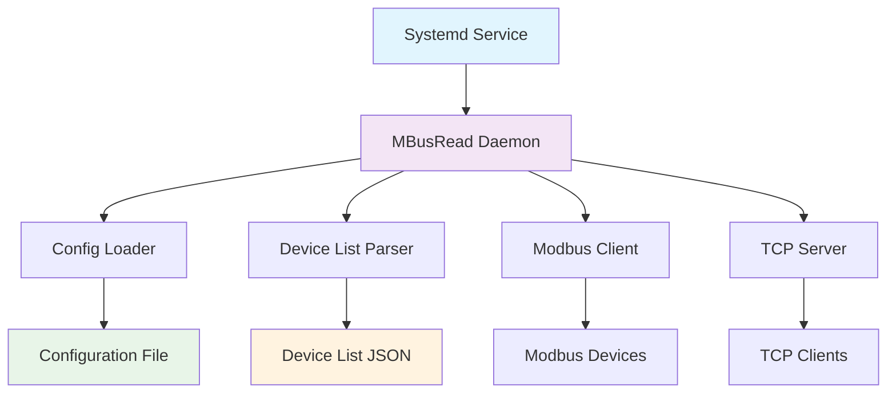

# MBusRead - ModBus TCP/RTU Polling Service
## Описание
MBusRead - это система опроса Modbus устройств, работающая как демон systemd. Сервис опрашивает устройства в соответствии с конфигурационным файлом и указанным интервалом, предоставляя данные через TCP сокет и Websocket. 

## Основные возможности:
- Поддержка протоколов: Modbus TCP и RTU (последовательный порт)
- Функции Modbus: 2 (Input Bits), 3 (Holding Registers), 4 (Input Registers)
- Управление устройствами: Гибкая конфигурация через JSON файл
- Отказоустойчивость: Автоматическое переподключение при потере соединения
- Мониторинг: Подробное логирование с различными уровнями
- Доступ к данным: TCP API и Websocket с JSON форматом
- Масштабируемость: Поддержка множества экземпляров через systemd templates

## Архитектура


## Установка и сборка
### Предварительные требования
```bash
# Установка зависимостей (Debian/Ubuntu)
sudo apt update
sudo apt install -y libmodbus-dev libjansson-dev build-essential libssl-dev

```

### Сборка из исходников
-  Клонирование или создание структуры проекта:
```bash
# Клонирование репозитория
git clone https://github.com/akarnaukh/mbpoll.git
cd mbusread

# Сборка проекта
make all

# Установка
sudo make install
```
### Makefile цели
```bash
make all           # Очистка, сборка и создание шаблонов
make clean         # Очистка сборки
make debug         # Сборка с отладочной информацией
make install       # Установка в систему
make uninstall     # Удаление из системы
make template      # Создание шаблонов конфигурации
make monitor       # Мониторинг логов сервиса
make client-test   # Тестирование TCP клиента
```
## Конфигурация

### Структура файлов
```text
/etc/mbusread/
├── coold1.conf              # Конфигурация экземпляра
└── dev_list.json           # Список устройств
```
### Настройка конфигурации
- Пример /etc/mbusread/coold1.conf:
```ini
# ModBus Read Service Configuration
# Serial port settings 
# device = /dev/ttyS1@9600 
# or TCP device settings
device = 192.168.0.10:502

# Интервал между опросом в мс 
poll_interval_ms = 5000 

listing_ip = 0.0.0.0
listing_port = 24122

# Порт Websocket 
websocket_port = 24123

log_level = info
# Доступны - debug: Все пишем в лог, включая данные регистров,
# info: События modbus, warn - timeout при чтении,
# error - только критические ошибки

# Файл списка устройств
dev_list_file = /etc/mbusread/dev_list.json
```

### Файл списка устройств
Пример /etc/mbusread/dev_list.json:
```json
{
  "devices": {
    "10": {
      "3": {
        "s": 1,
        "q": 5
      },
      "4": {
        "s": 22,
        "q": 3
      }
    },
    "11-15": {
      "3": {
        "s": 0,
        "q": 10
      }
    }
  }
}
```
### Структура JSON:

- devices - объект с устройствами
    * Ключ: адрес устройства (например, "10" или диапазон "12-15")
    * Значение: объект с функциями Modbus
        * Ключ: номер функции (2, 3, 4)
        * Значение: объект с параметрами
            * s: стартовый адрес регистра
            * q: количество регистров

#### Поддерживаемые функции Modbus:

- `2`: Input Bits (дискретные входы)
- `3`: Holding Registers (регистры хранения)
- `4`: Input Registers (входные регистры)


## Управление сервисом
```bash
# Запуск одного экземпляра
sudo systemctl start mbusread@coold1

# Автозапуск при загрузке
sudo systemctl enable mbusread@coold1

# Проверка статуса
sudo systemctl status mbusread@coold1

# Просмотр логов
sudo journalctl -u mbusread@coold1 -f
sudo journalctl -u mbusread@coold1 -n 50 --no-pager
```
### Запуск нескольких экземпляров
```bash
# Создание конфигураций для разных устройств
sudo cp /etc/mbusread/coold1.conf /etc/mbusread/device2.conf
sudo nano /etc/mbusread/device2.conf

# Запуск нескольких экземпляров
sudo systemctl start mbusread@coold1
sudo systemctl start mbusread@device2

# Мониторинг всех экземпляров
sudo journalctl -u 'mbusread@*' -f
```

### Ручной запуск для отладки
``` bash
# Запуск с выводом в консоль
/usr/local/bin/mbusread /etc/mbusread/coold1.conf

# Запуск с отладочным уровнем логов
sudo systemctl stop mbusread@coold1
sudo /usr/local/bin/mbusread /etc/mbusread/coold1.conf 2>&1 | tee /tmp/mbusread.log
```

## TCP API
Сервис предоставляет данные через TCP сокет в формате JSON.
## Подключение к API
```bash
# Использование netcat
nc 0.0.0.0 24122 | head -c 1000

# Использование telnet
telnet 0.0.0.0 24122

# Использование Python скрипта
python3 -c "
import socket
import struct
import json

sock = socket.socket(socket.AF_INET, socket.SOCK_STREAM)
sock.connect(('0.0.0.0', 24122))

# Читаем длину данных (4 байта)
data_len_bytes = sock.recv(4)
data_len = struct.unpack('!I', data_len_bytes)[0]

# Читаем JSON данные
json_data = sock.recv(data_len)
data = json.loads(json_data.decode('utf-8'))
print(json.dumps(data, indent=2))

sock.close()
"
```
### Формат ответа
```json
{
  "devices": [
    {
      "address": 10,
      "available": true,
      "registers": [
        {
          "function": 3,
          "start": 1,
          "quantity": 5,
          "values": [21, 3, 3, 0, 0]
        },
        {
          "function": 4,
          "start": 22,
          "quantity": 3,
          "values": [255, 2437, 1]
        }
      ]
    },
    {
      "address": 11,
      "available": false,
      "registers": [
        {
          "function": 3,
          "start": 1,
          "quantity": 5,
          "values": ["na", "na", "na", "na", "na"]
        }
      ]
    }
  ],
  "timestamp": 1672156800
}
```

### Поля ответа:

- devices: массив устройств
    - address: адрес Modbus устройства
    - available: доступность устройства (true/false)
    - registers: массив диапазонов регистров
        - function: функция Modbus
        - start: начальный адрес
        - quantity: количество регистров\
        - values: значения регистров или "na" если недоступно
- timestamp: метка времени Unix

## Логирование
### Уровни логирования

- **`debug`**: Все сообщения, включая значения регистров
- **`info`**: Основные события (подключения, опросы)
- **`warn`**: Предупреждения (таймауты, частичные чтения)
- **`error`**: Критические ошибки

### Просмотр логов
```bash
# Все логи сервиса
sudo journalctl -u mbusread@coold1

# Логи с фильтрацией по уровню
sudo journalctl -u mbusread@coold1 | grep -E "(ERROR|WARN|INFO|DEBUG)"

# Отслеживание логов в реальном времени
sudo journalctl -u mbusread@coold1 -f

# Логи с временными метками
sudo journalctl -u mbusread@coold1 -o short-precise
```
### Пример логов
```text
INFO: === Starting mbusread service ===
INFO: Configuration file: /etc/mbusread/coold1.conf
INFO: === Step 1: Loading configuration ===
INFO: Loading configuration from: /etc/mbusread/coold1.conf
INFO: Device: 192.168.1.100:502
INFO: TCP device: 192.168.1.100:502
INFO: Poll interval: 5000 ms
INFO: TCP server will listen on: 0.0.0.0:24122
INFO: Configuration loaded successfully
INFO: === Step 2: Loading device list ===
INFO: Total devices to load: 2
INFO: Successfully loaded 2 devices
INFO: === Step 3: Initializing Modbus connection ===
INFO: TCP Modbus connection established: 192.168.1.100:502
INFO: === Step 4: Checking Modbus connection ===
INFO: Modbus connection is OK
INFO: === Step 5: Starting TCP server ===
INFO: TCP server listening on 0.0.0.0:24122
INFO: === Service initialization complete ===
DEBUG: === Polling cycle 1 ===
DEBUG: Polling device 10
DEBUG: Device 10 (func 3): 0015 0003 0003 ...
DEBUG: Device 10 polled successfully
```
## Управление памятью
Сервис управляет памятью следующим образом:
1. Выделение при старте: Память выделяется для всех устройств и диапазонов регистров
2. Динамическое выделение: Значения регистров выделяются при первом успешном чтении
3. Освобождение: При недоступности устройства память освобождается
4. Очистка: Все ресурсы освобождаются при завершении работы

## Отказоустойчивость
### Обработка ошибок
1. **`Connection timed out`**: Не является критической ошибкой, устройство помечается как недоступное
2. **`Modbus устройство недоступно`**: Последующие функции для данного устройства пропускаются
3. **`UART/TCP недоступен`**: Критическая ошибка, попытка переинициализации соединения
4. **`Некорректный JSON dev_list`**: Критическая ошибка, сервис завершает работу

## Переподключение
### При потере соединения:
1. Логируется предупреждение
2. Закрывается существующее соединение
3. Ожидается 2 секунды
4. Выполняется попытка переподключения
5. При неудаче - экспоненциальная задержка до 30 секунд

## Структура проекта
```text
mbusread/
├── src/                    # Исходный код
│   ├── main.c             # Главная функция
│   ├── daemon.c           # Функции демонизации и логирования
│   ├── daemon.h           # Заголовочный файл
│   ├── config.c           # Загрузка конфигурации
│   ├── config.h           # Заголовочный файл
│   ├── modbus_client.c    # Modbus клиент
│   ├── modbus_client.h    # Заголовочный файл
│   ├── device_list.c      # Парсинг списка устройств
│   ├── device_list.h      # Заголовочный файл
│   ├── tcp_server.c       # TCP сервер
│   └── tcp_server.h       # Заголовочный файл
├── build/                 # Собранные файлы
│   ├── mbusread          # Исполняемый файл
│   ├── systemd/
│   │   └── mbusread@.service  # Systemd unit файл
│   └── config/
│       └── mbusread.conf      # Шаблон конфигурации
├── Makefile              # Файл сборки
└── README.md            # Документация
```

## Разработка
### Сборка для разработки
```bash
# Сборка с отладочной информацией
make debug

# Запуск тестового окружения
./debug_service.sh

# Проверка зависимостей
./check_libmodbus.sh
```

### Тестирование
```bash
# Тестирование TCP клиента
./test_tcp_client.sh

# Тестирование полного цикла
./install_and_test.sh
```
### Отладка
```bash
# Запуск под strace
strace -f -o /tmp/mbusread.strace /usr/local/bin/mbusread /etc/mbusread/coold1.conf

# Запуск под gdb
gdb /usr/local/bin/mbusread
(gdb) run /etc/mbusread/coold1.conf

# Проверка утечек памяти
valgrind --leak-check=full /usr/local/bin/mbusread /etc/mbusread/coold1.conf
```

## Устранение неполадок
### Распространенные проблемы
1. Сервис не запускается
```bash
# Проверка конфигурационного файла
sudo /usr/local/bin/mbusread /etc/mbusread/coold1.conf

# Проверка логов systemd
sudo journalctl -u mbusread@coold1 -n 50 --no-pager

# Проверка прав доступа
ls -la /etc/mbusread/
sudo chmod 644 /etc/mbusread/coold1.conf
sudo chmod 644 /etc/mbusread/dev_list.json
```
2. Modbus соединение постоянно теряется
```bash
# Увеличить интервал опроса
# В /etc/mbusread/coold1.conf:
poll_interval_ms = 10000

# Увеличить таймауты (пока не поддерживается)
# device = 192.168.1.100:502?timeout=3000
```
3. TCP сервер не принимает соединения
```bash
# Проверка порта
sudo netstat -tlnp | grep 24122

# Проверка фаервола
sudo ufw status
sudo ufw allow 24122/tcp

# Тестирование подключения
telnet localhost 24122
```
4. Ошибка JSON парсинга
```bash
# Проверка синтаксиса JSON
python3 -m json.tool /etc/mbusread/dev_list.json

# Проверка структуры
# Убедитесь, что есть объект "devices" и правильная структура
```
### Мониторинг производительности
```bash
# Использование памяти
ps aux | grep mbusread

# Количество TCP соединений
ss -t | grep 24122

# Частота опросов (лог каждые 100 циклов)
sudo journalctl -u mbusread@coold1 | grep "Statistics"
```
## Authors
- [@AKA_ZejroN](https://github.com/akarnaukh)
